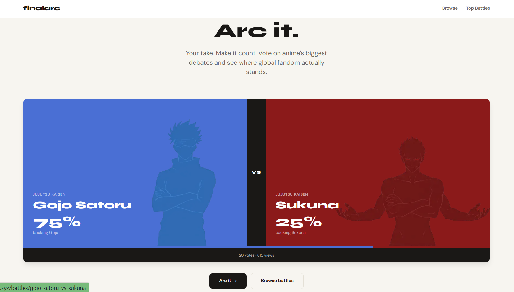
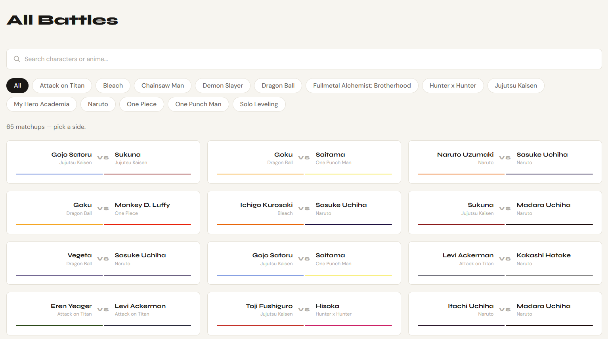
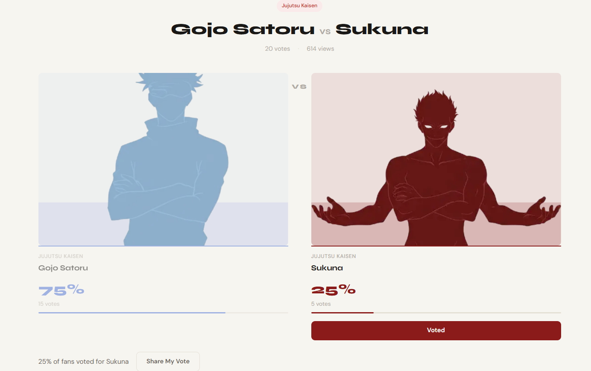

# finalarc

**The canonical record of anime fandom.**

Live at: [finalarc.xyz](https://finalarc.xyz)

---

## What it is

Finalarc is an anime character battle voting platform where fans vote on "who would win" debates across 65+ matchups — Gojo vs Sukuna, Naruto vs Sasuke, Goku vs Saitama, and more.

Every vote is a conviction signal. Every stance is on record.

---

## The bigger picture

Anime fandom is intentionally fragmented — fans watch on Crunchyroll, debate on Discord, track on MyAnimeList. What's missing is a portable fan identity that travels across all of it.

Finalarc is building that identity layer — starting with structured battle debates, expanding into cross-platform fan identity aggregation. The long-term vision: a verifiable, ownable record of who you are as an anime fan. Every side you've taken. Every debate you've won.

We call the vote action **"Arc"** — casting your Arc is declaring your conviction. Onchain, that becomes a permanent, tradeable cultural signal.

---

## What's built

- 65+ anime battle matchups with rich SEO content
- Anonymous voting with live Supabase Realtime results
- Comments, email notifications, battle suggestions
- Search + series filter on browse page
- Version context for every matchup (powerscaler-accurate)
- Mobile-optimised, Lighthouse 100 performance score

---

## Traction (Week 1)

- 500+ page views organically
- 12+ sessions from Google search
- Real users from US, India, and global anime community
- 128 GSC impressions on Madara vs Sukuna in week 1

---

## Tech stack

| Layer | Technology |
|-------|-----------|
| Frontend | Next.js 14 App Router + TypeScript |
| Styling | Tailwind CSS |
| Database | Supabase (PostgreSQL + Realtime) |
| Hosting | Netlify |
| Analytics | Google Analytics 4 + Microsoft Clarity |

---

## Web3 vision

Fan conviction is currently weightless. You vote, the number goes up, nobody remembers.

Onchain, that changes. A fan's debate record becomes a verifiable, ownable identity asset. Anime studios and creators can read real fan sentiment. Fans own the data they generate.

Bags is the natural home for the ownership and monetization layer on top of the finalarc conviction graph.

---

## Screenshots

> Homepage

> Battle page

> Browse page

---
